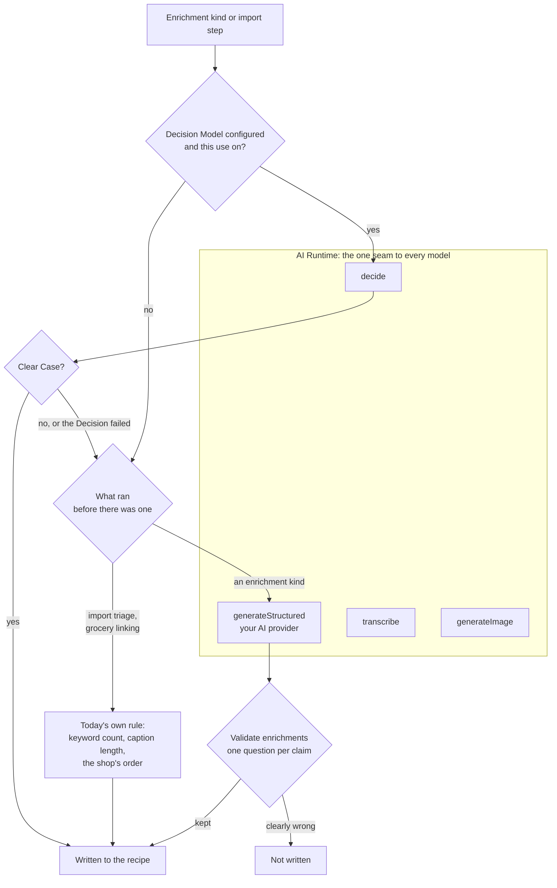

# AI provider

Several features are powered by AI. They're **off by default**, configure a provider to enable them.

AI enables:

- AI fallback when a recipe can't be imported from a URL structurally
- **Image import** from screenshots or photos of recipes
- **Video import** from YouTube Shorts, Instagram Reels, TikTok, Pinterest,
  and more
- **Recipe Enrichment**: tags, allergy indications, meal categories, nutrition values, ingredient to step linking, and a generated picture of the dish.
- **Unit conversion** between metric and US units

Optionally a user can also set a [Decision Model](#decision-model), this model 
answers the closed questions faster and cheaper, and validates the AI provider's
answers.

## Enable AI via the environment

:::note
AI can also be enabled via the admin settings.
:::

Set `AI_ENABLED=true` and configure a provider. Norish speaks the OpenAI API
format, so any OpenAI-compatible endpoint works (OpenAI, Azure OpenAI, Open
Router, a local Ollama/LM Studio server, …).

```yaml title="docker-compose.yml (environment)"
AI_ENABLED: "true"
AI_PROVIDER: openai
AI_MODEL: gpt-6-luna
AI_API_KEY: <your-api-key>
# For an OpenAI-compatible endpoint (Azure, OpenRouter, Ollama, …):
# AI_ENDPOINT: https://your-endpoint/v1
```

| Variable         | Description                          | Default      |
| ---------------- | ------------------------------------ | ------------ |
| `AI_ENABLED`     | Enable AI features globally          | `false`      |
| `AI_PROVIDER`    | AI provider                          | `openai`     |
| `AI_ENDPOINT`    | Custom OpenAI-compatible endpoint    | (empty)      |
| `AI_MODEL`       | Default model                        | `gpt-6-luna` | 
| `AI_API_KEY`     | API key for the provider             | (empty)      |
| `AI_TEMPERATURE` | Generation temperature               | `1.0`        |
| `AI_MAX_TOKENS`  | Maximum tokens for model responses   | `10000`      |
| `AI_TIMEOUT_MS`  | Maximum time for an AI response (ms) | `300000`     |

:::note
AI feature speed and quality vary by provider, model, and region. You can also
adjust AI settings in **Settings => Admin**.
:::

## What an OpenAI-compatible endpoint has to support

Norish asks for **structured output**: every AI requests an answer in form of a JSON schema. It asks in the strictest form a provider offers first
(`response_format: json_schema`), and falls back on its own to plain JSON mode
(`response_format: json_object`), carrying the schema in the prompt instead.

An endpoint that refuses **both** cannot run AI features at all.

## Recipe Enrichment

Recipe Enrichment is AI work that runs **after** a recipe is saved:
auto-tagging, allergy detection, auto-categorization, nutrition estimation,
recipe provenance, ingredient linking, and image generation.

Importing and creating a recipe never depend on it. The recipe is saved first;
enrichment is added separately, and a disabled, unavailable, slow, or failing
AI provider cannot make a save fail. This is done to keep the UI and data presentation fast.

### Automatic enrichment

Under **Settings => Admin => AI**, each kind has its own switch. They apply to
every newly created recipe, manual entry and every import path alike.

| Switch                   | What it does automatically                                                                | Default | Asks the Decision Model first                                         |
| ------------------------ | ----------------------------------------------------------------------------------------- | ------- | --------------------------------------------------------------------- |
| **Auto-tagging**         | Adds suggested tags without removing existing ones                                        | Off     | No; its tags are checked before they are written                      |
| **Allergy detection**    | Adds allergy tags for your household's configured allergies                               | On      | Yes, one question per household allergen                              |
| **Auto-categorization**  | Sets meal categories on recipes that have none                                            | Off     | Yes, one question per category                                        |
| **Nutrition estimation** | Estimates calories, fat, carbs, and protein when the recipe doesn't already have all four | Off     | No; the estimate is checked, logged only for now                      |
| **Recipe Provenance**    | Works out the country, region, cuisines, and a short note                                 | Off     | Yes, for the country and the Cuisines, under _Only existing cuisines_ |
| **Ingredient Linking**   | Links ingredient lines to the steps that have none                                        | Off     | No; its links are checked before they are written                     |
| **Image Generation**     | Draws a picture of the dish for new recipes that have no image at all                     | Off     | No                                                                    |

A kind that asks the [Decision Model](#decision-model) first falls back to the
AI provider whenever there is none, its use is switched off, it fails, or it
is not sure enough. The [Job-queue](./admin-settings.md#job-queue) mentions
what models are used.

### Supplied recipe data wins

Information you entered yourself, or that an import source stated explicitly, outranks automatic enrichment. Each group has its own precedence rule:

- Any meal category on the recipe suppresses **automatic** categorization.
- A **complete** nutrition group, calories, fat, carbs, and protein all
  present, suppresses **automatic** nutrition estimation; zeros count as present. An incomplete group does not: the estimate replaces the group as a whole, so the four values always agree with each other rather than mixing a supplied figure with an estimate.
- Any part of provenance, country, region, a cuisine, or the note, suppresses
  **automatic** provenance inference for the whole group. The note explains the
  whole claim, so it is never mixed with a value you set yourself.
- Ingredients are decided **per step**: a step you linked yourself is left alone, and only steps with no links at all are filled. This holds for a run you request by hand too. See
  [Step ingredients](../recipes/step-ingredients.md#letting-ai-fill-the-gaps).
- A recipe holding **any image at all**, a gallery image or the older single
  image field, suppresses **automatic** image generation entirely. Background
  work never replaces a stored picture; only the manual **Generate Picture**
  action and a bulk run with **Overwrite existing data** do.
- Empty and blank values do not count as supplied, so placeholders don't block useful enrichment.

Tags and allergy indications work differently: enrichment appends findings and
never removes what is already there, so existing tags never suppress it.

A run you request by hand is a deliberate refresh and does replace the current
categories, the complete nutrition group, or the complete provenance group.

### Tag strategy

**Tag strategy** decides which tags auto-tagging may use, independently of
whether it runs automatically:

| Strategy                       | Behaviour                                          |
| ------------------------------ | -------------------------------------------------- |
| **Predefined tags only**       | Only Norish's built-in tag list                    |
| **Predefined + existing tags** | Also tags already used by recipes on this instance |
| **AI can create new tags**     | May invent new tags when nothing fits              |

Turning automatic auto-tagging off keeps the selected strategy for manual runs.

### Cuisine strategy

**Cuisine strategy** decides whether provenance inference may add to the cuisine
list your administrator maintains, independently of whether it runs
automatically:

| Strategy                    | Behaviour                                           |
| --------------------------- | --------------------------------------------------- |
| **Only existing cuisines**  | Pick from the list; anything else is discarded      |
| **AI can add new cuisines** | Pick from the list, or add an entry that is missing |

Under both strategies the AI's answers are matched against the existing list
first, so a slight misspelling lands on the entry that already exists rather than
creating a near-duplicate. The list itself is managed under
**Settings => Admin => AI & Processing => Cuisines**; see
[Recipe provenance](../recipes/provenance.md).

### Image generation


Image generation needs its own provider, because most AI providers cannot draw: 
Anthropic, Mistral, DeepSeek, Groq and Perplexity expose no image model at all. 
So a self-hoster running a local text model can still point image generation 
somewhere else, or at an Ollama server running one of its image models. 
Configure it under **Settings => Admin => AI & Processing => Image Generation**:

| Field              | Notes                                                                                                                                                     |
| ------------------ | --------------------------------------------------------------------------------------------------------------------------------------------------------- |
| **Image Provider** | OpenAI, Google AI, Azure OpenAI, Ollama, LM Studio, or a generic OpenAI-compatible endpoint, only providers that can actually generate images are offered |
| **Endpoint URL**   | For Ollama, LM Studio and generic endpoints; optional custom resource URL for Azure                                                                       |
| **API Key**        | For the cloud providers                                                                                                                                   |
| **Image Model**    | Must be an image model, e.g. `gpt-image-1`, `imagen-4.0-generate-001` or Ollama's `x/z-image-turbo`, not a text model                                     |

When the image provider is the **same** provider as your AI configuration, the
endpoint and API key fall back to it, so you don't type a key twice.

All prompts for the image generation feature are editable under **Prompts**.

How pictures reach recipes:

- **Automatically**, when the **Image Generation** switch above is on: newly
  created recipes that have **no image at all** are made.
- **On request**, from a recipe's actions menu (**Generate Picture**)
  This does replace the recipes original image and is **destructive**.
  [Recipe enrichment](../recipes/enrichment.md#running-one-yourself).
- **In bulk**, through **Enrich All Recipes** below.

### Decision Model


A decision model is a specialised model trained to do classification. 
Norish can use these models to improve recipe detection on websites and
increase accuracy/validate output of the LLM provider. These models are
cheaper than regular LLM's and can replace the need for an LLM in various
cases such as categorisation.


Configure it under **Settings => Admin => AI & Processing => Decision Model**:

| Field                          | Notes                                                                                                                                                                                                                                                                                  |
| ------------------------------ | -------------------------------------------------------------------------------------------------------------------------------------------------------------------------------------------------------------------------------------------------------------------------------------- |
| **Provider**                   | _Disabled_ or _TypeSafe AI_                                                                                                                                                                                                                                                            |
| **API Key**                    | From your TypeSafe AI account.                                                                                                                                                                  |
| **Model**                      | Defaults to `jev-latest` release                                                                                                                                                                                                                   |
| **Use the Decision Model for** | One multi-select: _Auto-categorization_, _Allergy detection_, _Recipe Provenance_, _Grocery linking_, _Validate enrichments_. **Everything is selected** the moment a Decision Model is configured; deselect what it should leave to the AI provider. Import triage is not in the list |

What it speeds up:

- **Auto-categorization** asks four questions instead of asking a language
  model to write the words.
- **Allergy detection** asks one question per household allergen.
- **Recipe Provenance**, under _Only existing cuisines_, settles the country and
  the Cuisines by Decision and has the AI provider write the region and the
  note.
- **Import triage** Not changeable always on with a Decision Model. Asks whether
  a page is a recipe before an AI extraction is attempted, whether an Instagram
  or Facebook caption holds a recipe before transcribing and whether
  a structured parse is complete enough to keep.
- **Grocery linking** ranks the products a shop offered for a grocery and links
  its pick when that is likelier than every alternative together.
  [Prices](../groceries/prices.md#which-product).

When _Validate enrichments_ is selected, every enrichment run's
**own** output is checked before it is written. A tag, category, Cuisine or
step link the Decision Model is clearly sure is wrong is not written.

What it cannot do: extract a recipe, estimate nutrition, write a provenance
note, convert units, link a step's ingredient shares, or generate an image.

The below diagram explains the sequence.



### Run it on your whole library

Automatic enrichment only runs when a recipe is created, so recipes imported
before you enabled a switch, or before an enrichment kind existed, never
catch up on their own. **Settings => Admin => AI & Processing => Bulk Enrichment
=> Enrich All Recipes** queues every enrichment whose
automatic switch is enabled, for every recipe on the server.

**This action can be expensive.**


The confirmation also offers **Overwrite existing data**, which turns the behaviour from appending into redoing them. 

- **It cannot be undone, and it does not spare your own work.**
- **It costs more than the default sweep.**
- **Tags and allergy indications are never overwritten**

## Prompts


All prompts norish uses are customisable under the [admin settings](./admin-settings.md)

## Video import

Video import downloads the clip with `yt-dlp`, transcribes the audio, and uses
the AI provider to extract the recipe.

Links from YouTube, Instagram, TikTok, Facebook, Pinterest (including `pin.it`
share links), X, Threads, Snapchat, Vimeo, Dailymotion, Douyin, Bilibili, and
RedNote are recognised as videos.

| Variable                   | Description                                                                                  | Default                                   |
| -------------------------- | -------------------------------------------------------------------------------------------- | ----------------------------------------- |
| `VIDEO_PARSING_ENABLED`    | Enable the video parsing pipeline                                                            | `false`                                   |
| `VIDEO_MAX_LENGTH_SECONDS` | Maximum accepted video length                                                                | `120`                                     |
| `YT_DLP_VERSION`           | yt-dlp release a development install downloads on first use (the Docker image ships its own) | `2026.08.19`                              |
| `YT_DLP_BIN_DIR`           | Folder containing the yt-dlp binary                                                          | `./.runtime/bin` (dev), `/app/bin` (prod) |
| `YT_DLP_PROXY`             | HTTP/SOCKS proxy URL for yt-dlp downloads                                                    | (empty)                                   |

### Photo posts and reels

An Instagram or Facebook post with no video is imported from its caption alone,
which only works when the caption holds the whole recipe. Norish decides which
path to take by asking `yt-dlp` whether the post has a video stream.

## Transcription

Transcription turns the video's audio into text for the AI step.

| Variable                 | Description                                     | Default     |
| ------------------------ | ----------------------------------------------- | ----------- |
| `TRANSCRIPTION_PROVIDER` | Transcription provider                          | `disabled`  |
| `TRANSCRIPTION_ENDPOINT` | Transcription endpoint (local/custom providers) | (empty)     |
| `TRANSCRIPTION_API_KEY`  | Transcription API key                           | (empty)     |
| `TRANSCRIPTION_MODEL`    | Transcription model                             | `whisper-1` |

When the endpoint or API key is left empty, transcription falls back to the AI
configuration's endpoint and key.
