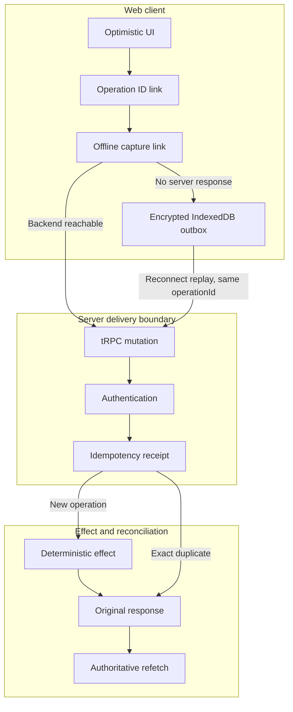
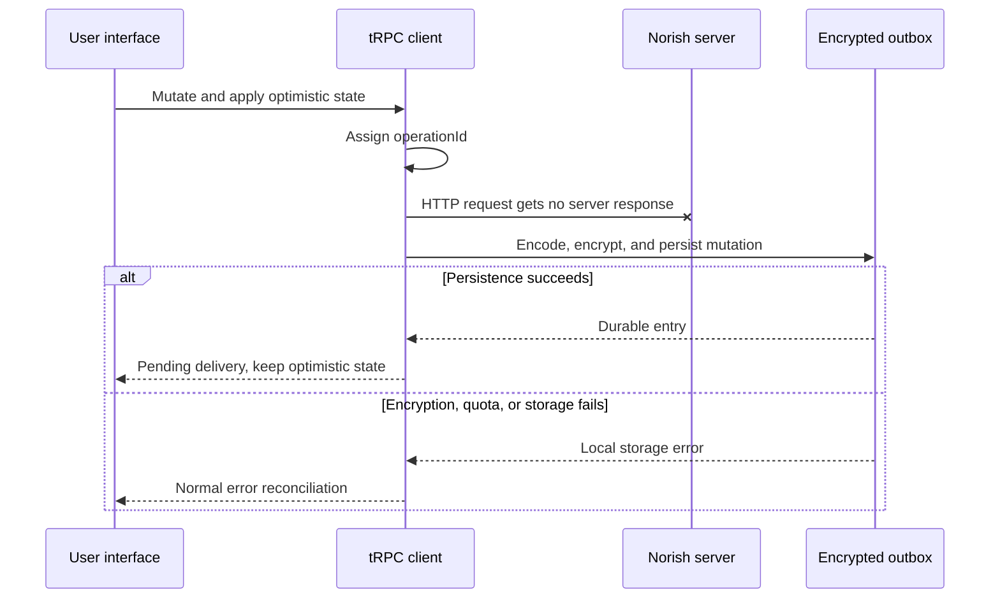
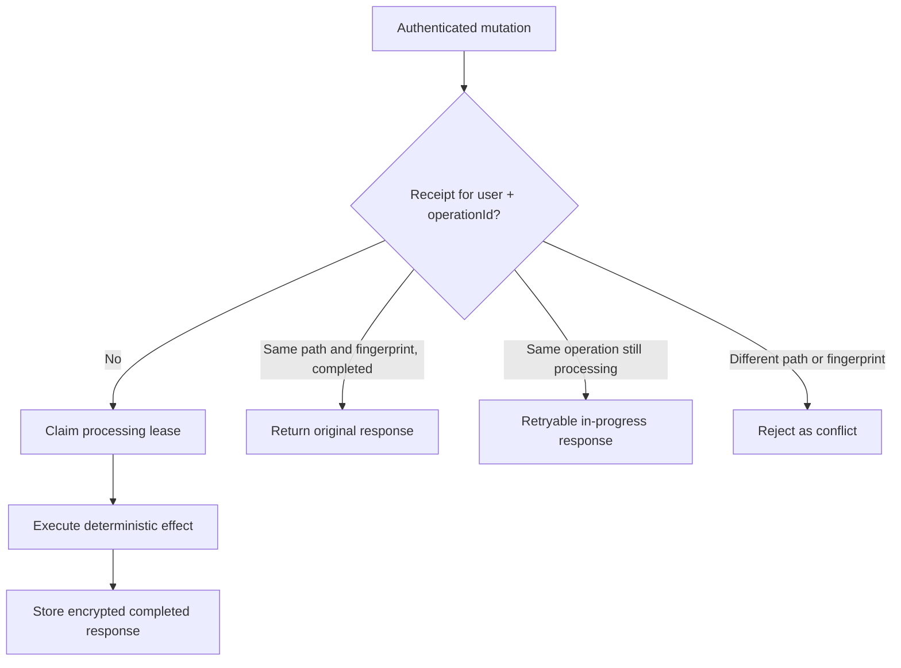
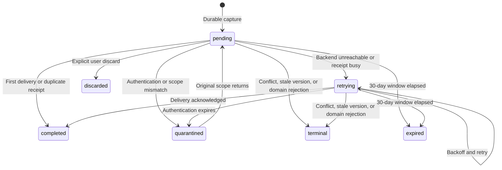

# Offline mutation delivery

Starting in `0.20.0-beta`, the Norish web client can preserve a mutation when
the backend cannot be reached and deliver it after connectivity returns. The
system combines a browser-side encrypted outbox with server-side idempotency
receipts. The outbox provides durability; receipts and deterministic mutation
contracts prevent a retry from repeating the same logical effect.

This implementation is web-only. The browser must be running for replay;
Norish does not currently use a service worker for background mutation
delivery.

## Architecture

Every mutation receives one stable `operationId` before its first network
attempt. That identity crosses the web outbox, HTTP transport, receipt store,
queue jobs, and realtime diagnostics.

The relevant implementation boundaries are:

| Boundary                      | Responsibility                                                                                   |
| ----------------------------- | ------------------------------------------------------------------------------------------------ |
| operation ID link             | Generates one UUID for a logical mutation and preserves it on replay.                            |
| web outbox link               | Captures only mutations that failed without obtaining a server response.                         |
| IndexedDB repository          | Encrypts input, enforces quota and size checks, and persists ordered delivery state.             |
| replay coordinator            | Owns one replay pass, enforces FIFO ordering, classifies outcomes, and refetches active queries. |
| tRPC receipt middleware       | Authenticates, fingerprints, claims, completes, and replays principal-scoped receipts.           |
| deterministic effect contract | Makes database, BullMQ, file, and deferred effects safe across crash recovery.                   |

## First delivery and offline capture

The UI remains optimistic: it updates immediately and does not wait for a slow
database write before rendering the intended state. When transport fails, the
client only reports a queued delivery after encryption and the IndexedDB
transaction both succeed.

A server/domain error is not an offline signal. If the backend returns a
validation, authorization, conflict, or other terminal response, the request
is not silently queued.

## What is stored in the browser

Each outbox entry contains the backend origin, authenticated user ID,
`operationId`, tRPC path, payload kind, creation order, retry metadata, state,
and expiry. Inputs are serialized losslessly:

- ordinary values use SuperJSON;
- `FormData` preserves field order, duplicate names, strings, `Blob` bytes,
  file names, MIME types, and last-modified metadata;
- encoded inputs and retained one-time results are encrypted with an
  origin-owned, non-extractable Web Crypto key.

Entries are scoped to both backend origin and user. A different user or backend
cannot replay them. Normal server authentication and authorization still run
for every attempt; client scoping is an additional safety boundary, not a
replacement for API authorization.

The first release limits an encoded mutation payload to 50 MiB and checks the
browser's estimated storage quota before acknowledging queued delivery.

## Receipt processing

The server keys receipts by authenticated principal and `operationId`, then
binds that identity to the procedure path and a canonical request fingerprint.
Raw request bodies are not stored in the receipt table. Successful response
snapshots are encrypted so an exact retry can return the original result,
including create IDs or one-time credentials.

PostgreSQL-only mutations commit the domain write and receipt completion in the
same transaction. Effects outside PostgreSQL use stable identities: BullMQ
jobs derive their identity from the operation, creates use deterministic entity
IDs, and media operations target deterministic paths.

## Replay and reconciliation

Replay starts when the application is running and authentication is ready. It
also starts on the browser's `online` event and after a WebSocket reconnect.
Only one in-process coordinator can run at a time.

Entries are delivered serially in creation order. A retryable head entry blocks
later entries so an offline create cannot be overtaken by a dependent update or
delete. Retry delay uses bounded exponential backoff. After every pass settles,
Norish refetches active TanStack queries to converge the optimistic cache with
authoritative server state.

### Outcome handling

| Outcome                    | Client behavior                                                  |
| -------------------------- | ---------------------------------------------------------------- |
| no server response         | Persist or update the existing entry, then retry with backoff    |
| receipt still processing   | Keep the head entry and retry later                              |
| success or exact duplicate | Complete the entry and refetch authoritative data                |
| authentication failure     | Quarantine and stop the pass                                     |
| conflict or stale version  | Mark terminal, explain the failed optimistic change, and refetch |
| terminal domain error      | Stop retrying that entry and surface the server result           |
| local expiry               | Do not send; mark expired and refetch                            |
| one-time API-key result    | Keep the encrypted response until the same user consumes it      |

## Retention and cleanup

After successful delivery, the browser deletes the outbox entry immediately.
One-time encrypted results are stored separately until the matching user
consumes them. Pending browser entries and completed server receipts expire
after 30 days, so a supported replay cannot outlive its idempotency receipt.

## User experience during connection loss

Connection loss no longer mounts a full-screen web overlay. The current screen
remains interactive, optimistic changes stay visible after durable capture,
and the outbox status surface communicates queued, retrying, quarantined,
terminal, and expired operations. Queries remain receipt-free and recover via
normal reconnect refetching.

For recipe creation, navigation is delivery-aware. An online acknowledgement
navigates to the reserved recipe ID. A durably queued create stays on the
currently loaded form so Next.js does not request an unavailable RSC payload
and fall back to a full browser navigation.
